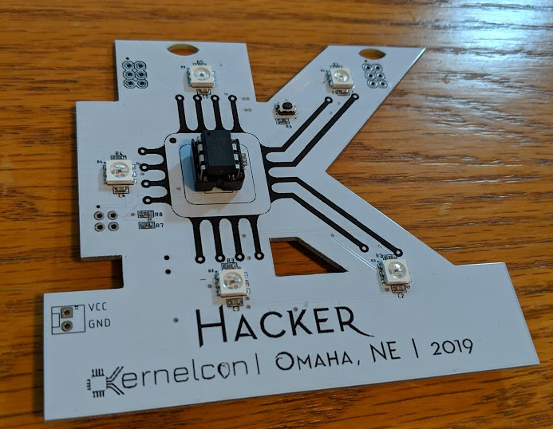
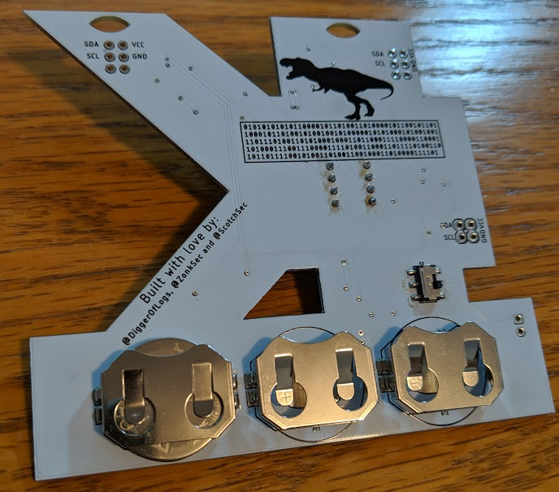

# kernelcon-2019-badge
the badge was controlled by an atmel tiny85 (attiny85). the badge had three slots for cr2032 batteries. the five LEDs are addressable RGBs (apa102). a button can be used to change modes, which are the following:
* fader mode, each LED faded between colors independently 
* freeze of of whatever the previous state was
* fader mode, all LEDs faded between colors in unison
* freeze of of whatever the previous state was
* binary blink out
* rave mode (flashing colors)
* looping animation with a color change after each lap

## ctf challenges
all the badge challenges are solved via a single multi-container docker application found in "docker" directory. 

to run it:
1.  run "docker-compose up" inside the "docker" directory.

### challenge 1 | How can we sit in the *light* of discovery and not act?
> hint: sometimes blinks have meaning

find mode on badge that outputs binary. convert binary to ascii, which gives you a URL ("nedry.tech", which will take you to the docker app). the landing page will earn you a flag.

### challenge 2 | It's an Interactive ~~CD-ROM~~ website!
> hint: there's no place like home.

discover the SSRF vuln. the data fetcher application can be used to access the private and sensative "DINO DNA SERVICE" listening on localhost:1337. its landing page will earn you a flag.

### challenge 3 | BINGO! DINO DNA!
> hint: looking for more DNA? a secret mode you seek.

interact with the "DINO DNA SERVICE" and pass it dinoID as GET params to earn the dino's DNA and a flag. one dinoID is provided on the landing page of the api. another is found on silkscreen of badge (rot13->base64->binary). another is found in a secret mode on the badge (hitting the mode button a 100 times or more) that outputs binary same as challenge 1, each type of badge (hacker,crew&organizer,speaker) will have its own dinoID. 

### challenge 4 | Timmy, let go! I'll *catch* you!
the SSRF data fetecher has a 'X_DINO_AUTH_FLAG' header when it makes request. if you make it make a request to a server you control, it will expose the flag.
